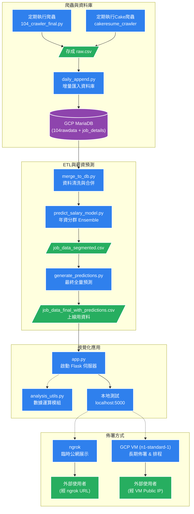

# 台灣科技職缺薪資預測平台

**104 人力銀行 x Cakeresume × AI 薪資預測 × 視覺化儀表板**  
Live Demo：http://localhost:5000 （執行 app.py 後開啟）ngrok link: https://trisomic-nonpermissively-suzanna.ngrok-free.dev/

## 專案特色

1. **每日自動爬蟲 + 資料庫增量更新** → 永遠掌握最新職缺
2. **雙階段薪資預測模型**
   - 第一階段：Ensemble + 年資分群（Junior / Senior）
   - 第二階段：僅用真實薪資訓練，最終預測無洩漏
3. **AI 自動填補「待遇面議」薪資**，使用者永遠只看到一組乾淨數字
4. **ECharts 技能樹 + 互動式市場儀表板**，視覺化
5. **完整資料工程管線**：爬蟲 → MariaDB → 預測 → Flask 前後端分離

## 專案架構圖



### 核心程式碼功能說明

#### 1. 資料收集與爬蟲 (Data Collection)

- **`104_crawler_final.py`**

  - **功能**：104 人力銀行爬蟲主程式，負責抓取職缺原始資料。
  - **細節**：
    - 支援 **斷點續爬**（透過 checkpoints 紀錄），中斷後可接續執行。
    - 具備 **複合去重** 機制（Job ID + 更新日期），避免重複抓取相同資料。
    - 自動偵測瀏覽器異常並 **重啟 Driver**，確保長時間執行穩定。
    - 資料會暫存於 `job_data_master_raw.csv`，包含完整的職缺描述與欄位。

- **`daily append.py`**
  - **功能**：資料庫增量匯入工具。
  - **細節**：
    - 監控爬蟲產生的 CSV 檔，將新資料 **增量匯入** 至 GCP MariaDB 的 `104rawdata` 資料表。
    - 使用 Unique Key 檢查，確保資料庫中不會有重複的職缺紀錄。
    - 可配合排程器（如 Windows Task Scheduler）實現自動化更新。

#### 2. 資料清洗與 ETL (Data Pipeline)

- **`merge_to_db.py`**
  - **功能**：跨平台資料整合與清洗 ETL 腳本。
  - **細節**：
    - 從資料庫撈取 `104` 與 `CakeResume` 兩大來源的資料。
    - **欄位標準化**：統一薪資格式（年薪/月薪/時薪轉月薪）、正規化地區名稱（縣市/國家）、清洗學歷與工作經歷格式。
    - **技能與關鍵字萃取**：根據 `skill_taxonomy.json` 自動從職缺描述中標記技能標籤。
    - 最終合併至 `jobs_unified` 資料表，作為模型訓練的黃金資料集。

#### 3. 薪資預測模型 (AI Model Training)

- **`predict_salary_model.py`**

  - **功能**：模型訓練與初步預測腳本（含分群策略）。
  - **細節**：
    - **資料預處理**：執行 Outlier 移除，並使用 **Jieba 中文分詞** 處理職缺描述（TF-IDF）作為特徵。
    - **年資分群 (Segmentation)**：將職缺分為 **Junior (<3 年)** 與 **Senior (3 年以上)** 兩組分別訓練，提升預測精準度。
    - **集成模型 (Ensemble)**：結合 `RandomForest`、`XGBoost`、`CatBoost`、`GradientBoosting` 四大模型進行 Voting。
    - 產出訓練報告 `salary_prediction_report.txt` 與殘差圖，評估模型效能（MAE/R²）。

- **`generate_predictions.py`**
  - **功能**：最終推論腳本（Production Inference）。
  - **細節**：
    - 使用全量資料重新訓練模型，並對 **所有職缺** 進行最終薪資預測。
    - 針對「待遇面議」的職缺填補預測值，針對已有薪資的職缺則保留原值（或計算誤差）。
    - 產出最終檔案 `job_data_final_with_predictions.csv`，這是 Flask 網站 **唯一的資料來源**，確保前後端資料一致且無洩漏。

#### 4. 網頁後端與視覺化 (Web App & Visualization)

- **`app.py`**

  - **功能**：Flask 網頁伺服器主程式。
  - **細節**：
    - 提供 RESTful API (`/api/jobs`, `/api/analysis`) 供前端 Ajax 呼叫。
    - 實作多重篩選功能（地區、薪資範圍、管理責任、遠端工作、技能分類等）。
    - 啟動後可於 `localhost:5000` 瀏覽，並支援透過 Ngrok 公開。

- **`analysis_utils.py`**
  - **功能**：儀表板數據分析核心邏輯。
  - **細節**：
    - 封裝所有 ECharts 圖表所需的統計運算。
    - 計算薪資分佈、技能關聯網絡 (Network Graph)、文字雲 (Word Cloud)、年資薪資趨勢等數據。
    - 確保前端圖表資料的即時性與準確性。

#### 5. 其他輔助工具

- **`export_from_database.py`**：資料庫備份工具，可將資料庫內所有 Table 匯出為 CSV。
- **`db_config.py`**：資料庫連線設定檔（含帳號密碼，Git Ignored）。
- **`skill_taxonomy.json`**：技能樹定義檔，用於將技能關鍵字歸類（如 Backend, Frontend, DevOps 等）。

## 快速啟動（5 步驟，10 分鐘內跑起來）

```bash
# 1. 爬蟲（範例抓前50頁）
python 104_crawler_final.py --end_page 50

# 2. 匯入資料庫
python daily_append.py

# 3. 不同人力銀行格式清理後合併匯入新table
merge_to_db.py

# 4. 初步預測 + 產生報告
python predict_salary_ensemble_segmented_v7.py

# 5. 最終預測（無資料洩漏）
python generate_predictions.py

# 6. 啟動網站
python app.py
# → 瀏覽器打開 http://localhost:5000
```

## 技術棧

Python, Selenium, Pandas, Scikit-learn, XGBoost, CatBoost
Flask + ECharts 5
MariaDB (GCP)
jieba 中文分詞
