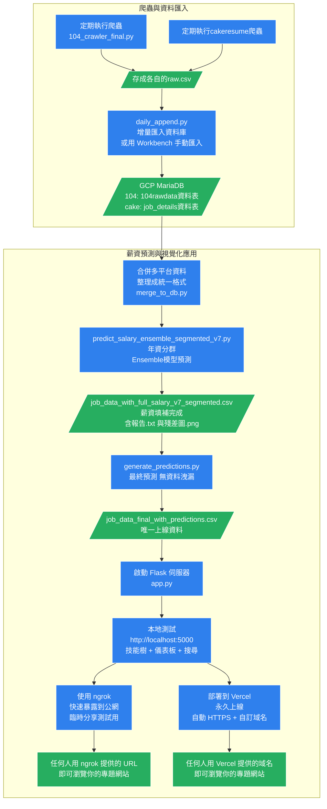

# 台灣科技職缺薪資預測平台  
**104 人力銀行 x Cakeresume × AI 薪資預測 × 視覺化儀表板**  
Live Demo：http://localhost:5000 （執行 app.py 後開啟）ngrok link: https://trisomic-nonpermissively-suzanna.ngrok-free.dev/

## 專案特色
1. **每日自動爬蟲 + 資料庫增量更新** → 永遠掌握最新職缺  
2. **雙階段薪資預測模型**  
   - 第一階段：Ensemble + 年資分群（Junior / Senior）  
   - 第二階段：僅用真實薪資訓練，最終預測無洩漏  
3. **AI 自動填補「待遇面議」薪資**，使用者永遠只看到一組乾淨數字  
4. **ECharts 技能樹 + 互動式市場儀表板**，視覺化  
5. **完整資料工程管線**：爬蟲 → MariaDB → 預測 → Flask 前後端分離

## 專案架構圖




## 檔案說明（只保留必要檔案）

| 檔案名稱                                    | 用途說明                                      |
|--------------------------------------------|---------------------------------------------|
| `104_crawler_final.py`                     | 每日執行，抓104職缺（支援斷點續爬）            |
| `daily_append.py`                          | 把新資料增量匯入 GCP MariaDB（可排程）         |
| `merge_to_db.py`                          | 把不同人力銀行資料清洗並統整             |
| `predict_salary_ensemble_segmented_v7.py`  | 從資料庫讀最新資料 → Ensemble + 分群預測（產生報告） |
| `generate_predictions.py`                  | 最終預測腳本（無資料洩漏）→ 產生 Flask 用的 CSV |
| `app.py`                                   | Flask 主程式，啟動網頁                        |
| `skill_taxonomy.json`                      | 技能樹分類                   |
| `analysis_utils.py`                        | 儀表板統計函數                               |
| `templates/index.html`                     | 前端                                |
| `job_data_final_with_predictions.csv`      | Flask 載入的唯一資料來源                      |

## 快速啟動（5 步驟，10 分鐘內跑起來）

```bash
# 1. 爬蟲（範例抓前50頁）
python 104_crawler_final.py --end_page 50

# 2. 匯入資料庫
python daily_append.py

# 3. 不同人力銀行格式清理後合併匯入新table
merge_to_db.py

# 4. 初步預測 + 產生報告
python predict_salary_ensemble_segmented_v7.py

# 5. 最終預測（無資料洩漏）
python generate_predictions.py

# 6. 啟動網站
python app.py
# → 瀏覽器打開 http://localhost:5000
```
## 技術棧

Python, Selenium, Pandas, Scikit-learn, XGBoost, CatBoost
Flask + ECharts 5
MariaDB (GCP)
jieba 中文分詞
