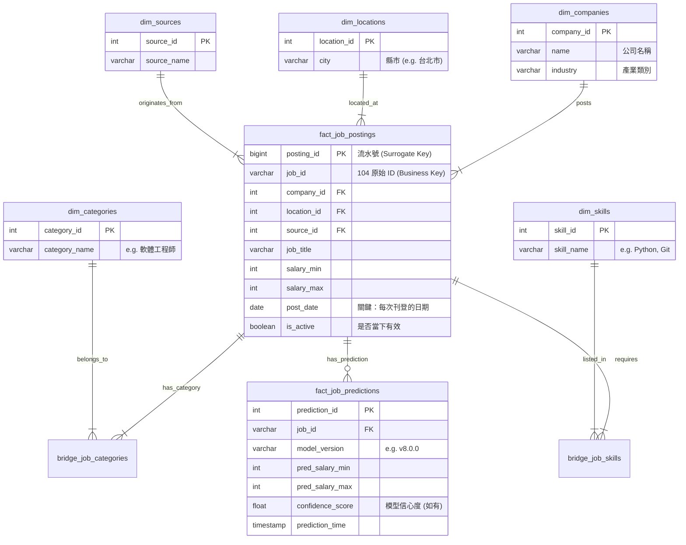

# 104 Job Data Warehouse Schema Design

## 1. 設計目標 (Design/Goals)

將目前的 Flat CSV (`job_data_master_raw.csv`) 轉換為適合分析與擴展的 **Star Schema (星狀綱要)**。此設計解決了以下問題：

- **Company/Skill 重複儲存**：節省空間並確保資料一致性。
- **多值欄位分析困難**：`job_categories`, `tools`, `work_skills` 透過 Bridge Table 展開，支援高效 SQL 查詢。
- **MLOps 整合**：預測結果與原始資料分離。

---

## 2. 實體關係圖 (ER Diagram)



---

## 3. 欄位映射詳情 (Column Mapping Strategy)

下表說明如何將您的 `job_data_master_raw.csv` 欄位映射到上述資料庫表結構。

| Raw CSV Column        | Target Table              | Target Column              | Transformation / Logic                                               |
| :-------------------- | :------------------------ | :------------------------- | :------------------------------------------------------------------- |
| `[Auto-Inc]`          | **fact_job_postings**     | `posting_id`               | 自動遞增流水號 (Primary Key)                                         |
| `job_id`              | **fact_job_postings**     | `job_id`                   | **Business Key** (不用唯一，可重複)                                  |
| `filesource`          | **fact_job_postings**     | `source_id`                | Metadata Mapping                                                     |
| `[Filename/Metadata]` | **fact_job_postings**     | `source_id`                | **Mapping Logic**: 若檔案來自 104 -> ID=1; 若來自 CakeResume -> ID=2 |
| `job_id`              | **fact_job_postings**     | `job_id`                   | 直接對應 (Primary Key)                                               |
| `job_title`           | **fact_job_postings**     | `job_title`                | 直接對應                                                             |
| `company`             | **dim_companies**         | `name`                     | 需去重 (Deduplicate)                                                 |
| `industry`            | **dim_companies**         | `industry`                 | 存入公司維度                                                         |
| `location`            | **dim_locations**         | `city`, `district`         | 解析字串 (e.g. "台北市中正區" -> City:台北市, Dist:中正區)           |
| `experience`          | **fact_job_postings**     | `experience_req`           | 標準化格式                                                           |
| `education`           | **fact_job_postings**     | `education_req`            | 標準化格式                                                           |
| `salary`              | **fact_job_postings**     | `salary_min`, `salary_max` | Regex 解析數字，另外存 `salary_type`                                 |
| `job_categories`      | **bridge_job_categories** | `category_id`              | **Split by `,` or `、`** -> 查表 `dim_categories` -> 寫入 Bridge     |
| `tools`               | **bridge_job_skills**     | `skill_id`                 | **Split by `,`** -> 查表 `dim_skills` (Type='Tool') -> 寫入 Bridge   |
| `work_skills`         | **bridge_job_skills**     | `skill_id`                 | **Split by `,`** -> 查表 `dim_skills` (Type='Skill') -> 寫入 Bridge  |
| `update_date`         | **fact_job_postings**     | `post_date`                | 格式清洗為 YYYY-MM-DD                                                |

---

## 4. 預測結果回寫流程 (Prediction Workflow)

這部分展示 MLOps 階段如何回寫資料：

1.  **Extract**: 從 DB 撈取 `fact_job_postings` JOIN `bridge_job_skills`。
2.  **Transform**:
    - One-Hot Encode Skills & Categories.
    - 計算 `exp_years` (數值化)。
3.  **Predict**: 丟入 Model 產生 `pred_min`, `pred_max`。
4.  **Load**:
    - 將結果寫入 **`fact_job_predictions`**。
    - **不要** update `fact_job_postings`，確保原始資料完整性。

---

## 5. 多來源資料整合策略 (Multi-Source Integration)

針對包含其他不同來源（如 CakeResume, Yourator）且欄位不一致（缺產業、缺學歷）的情況，建議採用 **Unified Fact Table (統一事實表)** 策略，而非分開存：

### 5.1 架構調整

1.  **新增 `dim_sources` 維度表**:
    - `source_id`: 1, 2
    - `source_name`: '104', 'CakeResume'
2.  **事實表 (`fact_job_postings`) 新增 `source_id` 欄位**。

### 5.2 缺失欄位處理 (Handling Missing Dimensions)

當 CakeResume 資料缺乏「產業 (`industry`)」或「學歷 (`education`)」時：

- **不要用 NULL**: 在 Data Warehouse 中，Foreign Key 盡量避免存 NULL，因為會造成 JOIN 時資料消失。
- **使用 "Unknown Member" (未知成員)**:
  - 在 `dim_companies` 若缺產業，填入 "不詳" 或 "Unknown"。
  - 在 `dim_education` 建立一筆 ID=0, Name='不拘/不詳'。
  - **ETL 邏輯**:
    ```python
    # Pseudo code
    if row['education'] is None:
        education_id = 0  # 指向 'Unknown'
    else:
        education_id = lookup_education_id(row['education'])
    ```

### 5.3 為什麼要合在一起？

這樣您才能回答跨平台的問題：

- _"Python 工程師在 104 和 CakeResume 上的平均薪資差異是多少？"_
- _"全台灣（不分平台）的 React 職缺總共有多少？"_

若分開存成 `table_104` 和 `table_cakeresume`，要做這種分析會非常痛苦 (需要大量的 UNION ALL)。
