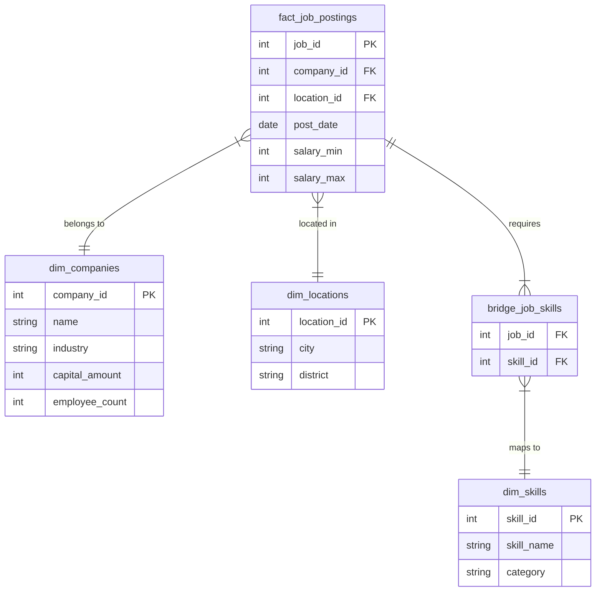

# 專案技術摘要 (Project Technical Summary)

本文件針對「薪資預測與職缺分析系統」的六個核心程式碼進行技術摘要。內容著重於架構設計、效能優化與機器學習應用，適合用於技術履歷或面試展示。

---

## 1. 資料爬蟲 (Web Crawler)

**檔案名稱**: `104_crawler_final.py`
**關鍵技術**: `Selenium`, `undetected-chromedriver`, `Parallel Processing`, `Anti-Bot Strategies`

- **加速優化 (Performance Optimization)**:
  - 採用 **Eager Loading Strategy**，僅等待 DOM 結構載入而不等待圖片與樣式資源，大幅縮短單頁爬取時間。
  - 實作資源攔截 (Resource Blocking)，禁用圖片與 CSS 載入以節省頻寬。
- **反爬蟲對抗 (Anti-Bot Evasion)**:
  - 整合 `undetected_chromedriver` 繞過自動化偵測。
  - 實作動態 User-Agent 切換與隨機延遲 (Jitter)。
  - **自動修復機制**: 當 chrome driver 出現異常 (e.g., disconnected, session invalid) 時，具備自動重啟與 Session 重建能力，確保長時間爬取的穩定性。
- **斷點續傳 (Resiliency)**:
  - 實作 Checkpoint 機制（記錄最後成功頁數），並比對 `unique_key` (Job ID + Update Date) 避免重複爬取。

## 2. 資料庫同步 (ETL Pipeline)

**檔案名稱**: `daily append.py` (import_to_mariadb.py)
**關鍵技術**: `Python`, `SQLAlchemy`, `MariaDB`, `Incremental Loading`

- **增量更新 (Incremental Updates)**:
  - 實作比對邏輯，僅篩選出 `unique_key` 不存在於資料庫的新職缺進行寫入，實現高效的每日增量更新 (Daily Append)。
- **併發安全 (Concurrency Safety)**:
  - 設計為可與爬蟲腳本同時運行的獨立進程。爬蟲負責寫入 CSV，此腳本負責讀取 CSV 並寫入 DB，解耦了採集與儲存層。
- **批次處理 (Batch Processing)**:
  - 使用 `chunksize` 參數進行分批寫入，避免 large transaction 造成的記憶體溢位或資料庫鎖死問題。

## 3. 機器學習模型訓練 (Model Training)

**檔案名稱**: `predict_salary_model.py`
**關鍵技術**: `Scikit-learn`, `XGBoost`, `CatBoost`, `Ensemble Learning`, `Feature Engineering`, `NLP`

- **集成學習 (Ensemble Learning)**:
  - 構建 `VotingRegressor`，整合四種異質模型：**RandomForest**, **GradientBoosting**, **XGBoost**, **CatBoost**，利用不同模型的特性互補以提升預測穩定度與準確率。
- **分眾建模 (Segmentation Strategy)**:
  - 針對工作年資將資料分為 **Junior (<3 年)** 與 **Senior (>=3 年)** 兩個子集合分別訓練，顯著解決了不同職涯階段薪資結構差異巨大的問題。
- **特徵工程 (Feature Engineering)**:
  - **NLP 處理**: 使用 `jieba` 對職缺描述 (Job Description) 進行斷詞，並透過 `TfidfVectorizer` 提取關鍵字特徵。
  - **薪資解析**: 使用 Regex 處理複雜的中文薪資格式（年薪、月薪、津貼範圍），並剔除極端值 (Outlier Removal using IQR)。
- **特徵篩選**:
  - 使用 `LassoCV` 進行 L1 正則化特徵篩選，自動剔除對於薪資預測無貢獻的雜訊特徵。

## 4. 預測推論 (Inference Pipeline)

**檔案名稱**: `generate_predictions.py`
**關鍵技術**: `ML Ops`, `Batch Inference`, `Data Imputation`

- **缺失值填補 (Data Imputation)**:
  - 針對標示為「面議」或無薪資資訊的職缺，利用訓練好的模型進行推論，補回潛在的市場薪資區間 (`pred_min`, `pred_max`)。
- **全量推論**:
  - 載入最新訓練好的模型權重，對全量資料集進行預測，並計算信賴指標 (MAE, R2 score)，為前端展示提供數據信心支援。

## 5. Web 後端 (Backend API)

**檔案名稱**: `app.py`
**關鍵技術**: `Flask`, `RESTful API`, `JSON Handling`

- **API 設計**:
  - 提供 `/api/jobs` (列表查詢) 與 `/api/analysis/*` (圖表數據) 等端點，實現前後端分離架構。
- **模組化設計**:
  - 將複雜的資料聚合邏輯抽離至 `analysis_utils`，保持 Controller 層 (Route Handlers) 的輕量與可讀性。
- **容錯載入**:
  - 具備 Data Fallback 機制，優先載入預測後的完整資料，若失敗則退回至基礎資料，確保服務不中斷。

## 6. 資料分析工具庫 (Data Analysis Utilities)

**檔案名稱**: `analysis_utils.py`
**關鍵技術**: `Pandas`, `NumPy`, `Data Visualization Logic`

- **複雜資料聚合 (Complex Aggregation)**:
  - 實作多維度統計函式 (e.g., `get_salary_boxplot`, `get_source_salary_stats`)，直接支援前端 ECharts 所需的資料結構。
- **技能關聯網絡 (Skill Network)**:
  - 計算技能共現矩陣 (Co-occurrence Matrix)，生成 `Nodes` 與 `Links` 結構，用於前端視覺化技能樹與關聯圖。
- **資料正規化**:
  - 處理非結構化的職缺屬性（如：經驗「1~3 年」、地點「台北市中正區」），標準化為統一格式以便於分組統計 (Group By)。

## 7. 可維護性評估 (Maintainability Assessment)

針對 AI 輔助開發可能導致程式碼架構混亂的疑慮，本專案採取了嚴謹的工程規範以確保長期的可維護性：

1.  **關注點分離 (Separation of Concerns)**:

    - 嚴格區分 **資料層** (Crawler/ETL)、**模型層** (Training/Inference) 與 **應用層** (App/Visualization)。各模組低耦合，例如 Crawler 只負責產出標準 CSV，不涉及資料庫或模型邏輯，便於單獨測試與替換。

2.  **與業務邏輯解耦的共用函式庫**:

    - 將複雜的統計邏輯 (如薪資中位數計算、技能相關性矩陣) 封裝於 `analysis_utils.py`。`app.py` 僅負責路由與參數傳遞，保持了路由層的潔淨，避免 "Spaghetti Code"。

3.  **防禦性程式設計 (Defensive Programming)**:

    - Crawler 具備 `restart_driver` 與 Exception Handling，能自動從崩潰中恢復。
    - Backend API 具備 Data Fallback 機制，即使預測檔遺失也能降級服務，提高系統韌性。

4.  **清晰的資料流 (Clean Data Pipeline)**:

    - `Raw Data` -> `Master Data` -> `Feature Enhanced Data` -> `Final Predictions`。每個階段都有明確的中間產物 (Artifacts)，便於追蹤資料與 Debug。

5.  **配置化管理 (Configuration Management)**:
    - 爬蟲參數 (Base URL, Query Params) 與資料庫連線資訊皆已抽離為參數或設定檔，而非 Hard-coded 在主程式中，便於因應不同環境進行部署。

## 8. 資料庫架構規劃 (Future Database Architecture)

目前的專案是將所有資料存在單一 CSV (Flat Table)，這在資料量少時很方便，但面對大量資料分析時會有效能瓶頸。針對 Data Engineer 面試，建議提出 **Star Schema (星狀綱要)** 的設計理念：

### 8.1 核心概念：事實 vs 維度

- **事實表 (Fact Table)**: 記錄「發生了什麼事」。這裡是 **`fact_job_postings`** (職缺刊登)，裡面存的是會隨時間增加的數據 (如薪資、刊登日期)。
- **維度表 (Dimension Table)**: 記錄「人事時地物」的詳細屬性。例如 **`dim_companies`** (公司資料)、**`dim_skills`** (技能資料)。

### 8.2 架構圖 (ER Diagram)



### 8.3 為什麼要這樣設計？ (Design Rationale)

1.  **解決「公司資料重複」問題 (Normalization)**:

    - **現況**: 100 筆「台積電」的職缺，CSV 裡就重複存了 100 次「半導體製造業」、「資本額 xxx」。
    - **改善**: 建立 `dim_companies`，只存 1 筆台積電資料。職缺表只要存 `company_id` 對應過去即可。
    - **優勢**: 節省儲存空間，且當公司資料更新 (例如員工數增加) 時，只要改 1 個地方，不用改 100 筆職缺。

2.  **解決「技能多對多」分析問題**:

    - **現況**: 技能是存成一長串字串 `"Python, SQL, AWS"`。要分析「會 SQL 的平均薪資」非常困難 (需要用 `LIKE '%SQL%'`，效能很差且不準)。
    - **改善**: 使用 `bridge_job_skills` (橋接表)。1 個職缺對應 3 個技能，就會在此表產生 3 筆紀錄。
    - **優勢**: 可以用簡單高效的 SQL 查詢：
      ```sql
      SELECT s.skill_name, AVG(f.salary_min)
      FROM fact_job_postings f
      JOIN bridge_job_skills b ON f.job_id = b.job_id
      JOIN dim_skills s ON b.skill_id = s.skill_id
      GROUP BY s.skill_name;
      ```

3.  **擴充性 (Scalability)**:
    - 未來如果想分析「地區房價 vs 薪資」，只需要擴充 `dim_locations` 表，完全不動到核心的職缺資料表。這就是 Data Warehouse 設計的精神。

### 8.4 實作範例: 從 Raw Data 到 Star Schema (ETL Workflow)

假設我們從爬蟲抓到一筆原始資料 (Raw CSV Row)：

```json
// Raw Data (類似 CSV 的一列)
{
  "job_id": "J001",
  "job_title": "Python 後端工程師",
  "company": "台積電",
  "industry": "半導體製造業",
  "salary_min": 60000,
  "tools": "Python, SQL, Django"
}
```

**轉換流程 (Transformation Logic):**

1.  **處理公司 (Dim_Companies)**:

    - 檢查 `dim_companies` 是否已有「台積電」？
    - 若無，插入並產生 ID (`CMP_001`, "台積電", "半導體製造業")。
    - 取得 `company_id = CMP_001`。

2.  **處理事實 (Fact_Job_Postings)**:

    - 將職缺寫入事實表，原本的字串 "台積電" 換成 ID。
    - `INSERT INTO fact_job_postings (job_id, company_id, title, salary_min) VALUES ('J001', 'CMP_001', 'Python 後端工程師', 60000)`

3.  **處理技能 (Dim_Skills & Bridge)**:
    - 將 `tools` 字串 `"Python, SQL, Django"` 拆解 (Split)。
    - **Python**: 查表得 `SK_101` -> 寫入 Bridge 表 `(J001, SK_101)`
    - **SQL**: 查表得 `SK_102` -> 寫入 Bridge 表 `(J001, SK_102)`
    - **Django**: 查表得 `SK_103` -> 寫入 Bridge 表 `(J001, SK_103)`

雖然這個過程在寫入時比較麻煩 (Write-Heavy)，但對於後續的讀取分析 (Read-Heavy) 會非常快且彈性。這正是 OLAP (Online Analytical Processing) 的核心精神。

### 8.5 預測結果回寫策略 (MLOps Integration)

針對 `job_data_final_with_predictions.csv` (包含預測薪資與特徵)，在正式的資料工程架構中，**強烈建議寫回資料庫**，但要與原始資料分開：

1.  **建立預測事實表 (`fact_job_predictions`)**:

    - 不要直接修改 `fact_job_postings` (保持 Raw Data 純淨)。
    - 建立專用表儲存推論結果：
      ```sql
      CREATE TABLE fact_job_predictions (
          job_id VARCHAR(50),
          model_version VARCHAR(20),  -- e.g., 'v7.0.1'
          predicted_salary_min INT,
          predicted_salary_max INT,
          prediction_date DATETIME,
          FOREIGN KEY (job_id) REFERENCES fact_job_postings(job_id)
      );
      ```

2.  **為什麼要這樣做？**:
    - **服務效能 (Serving Latency)**: Web App 直接查詢 DB (`SELECT * FROM fact_job_predictions WHERE job_id = ?`) 遠比每次啟動時載入 300MB 的 CSV 快且省記憶體。
    - **模型監控 (Model Monitoring)**: 可以追蹤同一個職缺在不同模型版本下的預測差異 (Model Drift)。
    * **特徵存儲 (Feature Store)**: 若特徵工程 (Feature Engineering) 很耗時，可以將處理後的特徵存入 `fact_job_features`，供下次訓練直接使用，不需每次重新從 Raw Data 計算。

### 8.6 特徵資料儲存策略 (Feature Storage Strategy)

針對特徵工程後產生的數百個欄位 (如 One-Hot Encoding)，**不建議** 直接在 SQL Table 開立數百個欄位儲存，原因與解法如下：

1.  **問題點 (Problem)**:

    - **稀疏性 (Sparsity)**: 300 個技能欄位中，一筆職缺可能只有 5 個是 `1`，其他 295 個都是 `0`。這在關聯式資料庫 (RDBMS) 非常浪費空間。
    - **Schema 僵化**: 只要多一個新技能，就要 `ALTER TABLE ADD COLUMN`，維護成本極高。

2.  **推薦作法 (Best Practice)**:

    - **方案 A (正規化儲存)**: 透過上述的 `bridge_job_skills` 儲存即可。訓練時再即時轉換 (On-the-fly) 成 sparse matrix。
    - **方案 B (Feature Store / NoSQL)**: 若為了推論速度必須存，建議將整條特徵向量序列化 (Serialized) 存成 **JSON** 或 **Binary Blob**。

      ```sql
      -- 不建議：
      -- CREATE TABLE job_features (id INT, skill_python INT, skill_java INT, ... 300 cols ...);

      -- 建議 (Hybrid Approach)：
      CREATE TABLE job_feature_store (
          job_id VARCHAR(50),
          feature_vector JSON,  -- e.g. {"skills": ["Python", "SQL"], "vector": [0,1,0...]}
          updated_at DATETIME
      );
      ```

    - 這樣的回答能展現您對 **"Wide Table vs Deep Table"** 以及 **NoSQL 應用場景** 的判斷力。

### 8.7 進階模型策略：職務類別分群訓練 (Category-Based Stratified Training)

針對您提到的「依據不同職務類別 (Category) 分群訓練」，這是一個非常專業的 **Model Architecture** 優化方向：

1.  **資料庫層面 (DB Layer)**:

    - 確實應該將 `job_categories` 正規化，建立 `bridge_job_categories` 表。這樣可以讓我們輕鬆撈出「所有 軟體工程類」或「所有 人資類」的職缺。

2.  **模型層面 (Modeling Layer)**:

    - **原理**: 不同職務的薪資結構差異巨大 (Domain Shift)。例如：「溝通能力」對業務是加薪項，對工程師可能影響不大。如果全部混在一起練 (Global Model)，模型會學到一個「平均值」，反而不準。
    - **作法 (Stratified Training)**:
      - 不要只練一個大模型。
      - 改為練 N 個小模型：`Model_Engineer`, `Model_Sales`, `Model_HR`...
    - **挑戰與解法 (The Challenge)**:
      - **Q**: 如果一個職缺同時是「PM」和「工程師」怎麼辦？
      - **A (Weighted Ensemble)**: 分別丟入 `Model_PM` 和 `Model_Engineer` 預測，然後將兩個預測結果 **平均** 或 **加權平均**。

    這是一個很棒的 Insight，能展現您不僅懂資料庫，還懂 **Domain Knowledge 如何影響機器學習的準確度**。
