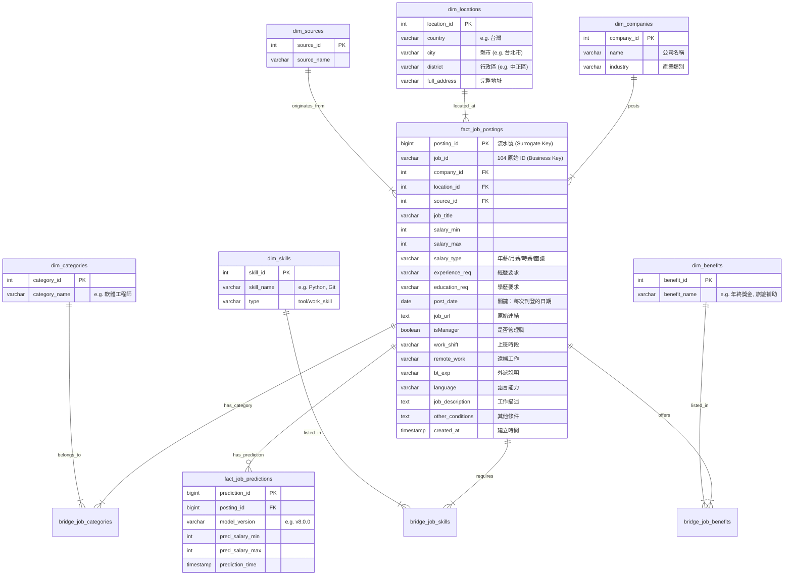

# 104 Job Data Warehouse Schema Design

## 1. 設計目標 (Design/Goals)

將目前的 Flat CSV (`job_data_master_raw.csv`) 轉換為適合分析與擴展的 **Star Schema (星狀綱要)**。此設計解決了以下問題：

- **Company/Skill 重複儲存**：節省空間並確保資料一致性。
- **多值欄位分析困難**：`job_categories`, `tools`, `work_skills` 透過 Bridge Table 展開，支援高效 SQL 查詢。
- **MLOps 整合**：預測結果與原始資料分離。

---

## 2. 實體關係圖 (ER Diagram)



---

## 3. 欄位映射詳情 (Column Mapping Strategy)

下表說明如何將您的 `job_data_master_raw.csv` 欄位映射到上述資料庫表結構。

| Raw CSV Column        | Target Table              | Target Column              | Transformation / Logic                                               |
| :-------------------- | :------------------------ | :------------------------- | :------------------------------------------------------------------- |
| `[Auto-Inc]`          | **fact_job_postings**     | `posting_id`               | 自動遞增流水號 (Primary Key)                                         |
| `job_id`              | **fact_job_postings**     | `job_id`                   | **Business Key** (不用唯一，可重複)                                  |
| `filesource`          | **fact_job_postings**     | `source_id`                | Metadata Mapping                                                     |
| `[Filename/Metadata]` | **fact_job_postings**     | `source_id`                | **Mapping Logic**: 若檔案來自 104 -> ID=1; 若來自 CakeResume -> ID=2 |
| `job_title`           | **fact_job_postings**     | `job_title`                | 直接對應                                                             |
| `company`             | **dim_companies**         | `name`                     | 需去重 (Deduplicate)                                                 |
| `industry`            | **dim_companies**         | `industry`                 | 存入公司維度                                                         |
| `location`            | **dim_locations**         | `city`, `district`         | 解析字串 (e.g. "台北市中正區" -> City:台北市, Dist:中正區)           |
| `experience`          | **fact_job_postings**     | `experience_req`           | 標準化格式                                                           |
| `education`           | **fact_job_postings**     | `education_req`            | 標準化格式                                                           |
| `salary`              | **fact_job_postings**     | `salary_min`, `salary_max` | Regex 解析數字，另外存 `salary_type` (年/月/日/時)                   |
| `salary_type`         | **fact_job_postings**     | `salary_type`              | 單位 (年/月/日/時/面議)                                              |
| `job_categories`      | **bridge_job_categories** | `category_id`              | **Split by `,` or `、`** -> 查表 `dim_categories` -> 寫入 Bridge     |
| `tools`               | **bridge_job_skills**     | `skill_id`                 | **Split by `,`** -> 查表 `dim_skills` (Type='Tool') -> 寫入 Bridge   |
| `work_skills`         | **bridge_job_skills**     | `skill_id`                 | **Split by `,`** -> 查表 `dim_skills` (Type='Skill') -> 寫入 Bridge  |
| `tags`                | **bridge_job_benefits**   | `benefit_id`               | **Split by `,`** -> 查表 `dim_benefits` -> 寫入 Bridge (e.g. 年終)   |
| `update_date`         | **fact_job_postings**     | `post_date`                | 格式清洗為 YYYY-MM-DD                                                |
| `link`                | **fact_job_postings**     | `job_url`                  | 原始連結                                                             |
| `management_resp...`  | **fact_job_postings**     | `isManager`                | boolean (是否管理職)                                                 |
| `work_shift`          | **fact_job_postings**     | `work_shift`               | 上班時段 (日班/晚班...)                                              |
| `remote_work`         | **fact_job_postings**     | `remote_work`              | 遠端工作 (完全/部分/否)                                              |
| `BT_EXP`              | **fact_job_postings**     | `bt_exp`                   | 出差外派說明                                                         |
| `languages`           | **fact_job_postings**     | `language`                 | 語言能力 (e.g. 英文--聽:精通...)                                     |
| `job_description`     | **fact_job_postings**     | `job_description`          | **Text (Source of Truth)** for NLP                                   |
| `other_conditions`    | **fact_job_postings**     | `other_conditions`         | **Text (Source of Truth)** for NLP                                   |

---

## 4. 預測結果回寫流程 (Prediction Workflow)

這部分展示 MLOps 階段如何回寫資料：

1.  **Extract**: 從 DB 撈取 `fact_job_postings` JOIN `bridge_job_skills`。
2.  **Transform**:
    - One-Hot Encode Skills & Categories.
    - 計算 `exp_years` (數值化)。
3.  **Predict**: 丟入 Model 產生 `pred_min`, `pred_max`。
4.  **Load**:
    - 將結果寫入 **`fact_job_predictions`**。
    - **不要** update `fact_job_postings`，確保原始資料完整性。

---

## 5. 多來源資料整合策略 (Multi-Source Integration)

針對包含其他不同來源（如 CakeResume, Yourator）且欄位不一致（缺產業、缺學歷）的情況，建議採用 **Unified Fact Table (統一事實表)** 策略，而非分開存：

### 5.1 架構調整

1.  **新增 `dim_sources` 維度表**:
    - `source_id`: 1, 2
    - `source_name`: '104', 'CakeResume'
2.  **事實表 (`fact_job_postings`) 新增 `source_id` 欄位**。

### 5.2 缺失欄位處理 (Handling Missing Dimensions)

當 CakeResume 資料缺乏「產業 (`industry`)」或「學歷 (`education`)」時：

- **不要用 NULL**: 在 Data Warehouse 中，Foreign Key 盡量避免存 NULL，因為會造成 JOIN 時資料消失。
- **使用 "Unknown Member" (未知成員)**:
  - 在 `dim_companies` 若缺產業，填入 "不詳" 或 "Unknown"。
  - 在 `dim_education` 建立一筆 ID=0, Name='不拘/不詳'。
  - **ETL 邏輯**:
    ```python
    # Pseudo code
    if row['education'] is None:
        education_id = 0  # 指向 'Unknown'
    else:
        education_id = lookup_education_id(row['education'])
    ```

### 5.3 為什麼要合在一起？

這樣您才能回答跨平台的問題：

- _"Python 工程師在 104 和 CakeResume 上的平均薪資差異是多少？"_
- _"全台灣（不分平台）的 React 職缺總共有多少？"_

若分開存成 `table_104` 和 `table_cakeresume`，要做這種分析會非常痛苦 (需要大量的 UNION ALL)。

---

## 9. 效能優化策略 (Indexing Strategy)

針對頻繁查詢的場景，已在 `fact_job_postings` 設置以下 **索引 (Index)**：

| 欄位 (Column) | 索引類型              | 目的 (Purpose)                                                            |
| :------------ | :-------------------- | :------------------------------------------------------------------------ |
| `job_id`      | **Standard Index**    | **快速查找歷史紀錄**: `WHERE job_id = 'J001'`                             |
| `post_date`   | **Standard Index**    | **時間區間篩選**: `WHERE post_date BETWEEN '2024-01-01' AND '2024-03-31'` |
| `salary_min`  | **Standard Index**    | **薪資範圍搜尋**: `WHERE salary_min > 50000`                              |
| `job_title`   | **Standard Index**    | **關鍵字搜尋**: `WHERE job_title LIKE '%Python%'`                         |
| `company_id`  | **Foreign Key Index** | **加速 JOIN**: 連結 `dim_companies`                                       |
| `source_id`   | **Foreign Key Index** | **來源篩選**: `WHERE source_id = 1`                                       |

這些索引能顯著提升前端 Dashboard 查詢與 Model 訓練撈取資料的速度。

---

## 6. 關鍵 Key 設定與設計決策 (Key Design Decisions)

本段落統整資料庫中各類型 Key (Primary Key, Foreign Key, Business Key) 的設定邏輯與原因：

### 6.1 主鍵選擇 (Primary Key Strategy)

- **Surrogate Key (代理鍵)**: `fact_job_postings.posting_id`
  - **設定**: 使用自動遞增整數 (Auto Integers)。
  - **原因**:
    1. **歷史追蹤**: 104 的 `job_id` 會重複 (例如同一職缺下架後又上架)，若直接用 `job_id` 當 PK 會無法儲存歷史快照。
    2. **效能優化**: 整數 Join 比字串 Join 快得多，且佔用空間更小。
- **Composite Key (複合鍵)**: Bridge Table (e.g., `bridge_job_skills`)
  - **設定**: `(posting_id, skill_id)` 聯合成為 PK。
  - **原因**: 確保同一份職缺不會重複標記相同的技能 (De-duplication)。

### 6.2 業務鍵 (Business Key)

- **Business Key**: `fact_job_postings.job_id`
  - **設定**: 來自來源網站的原始 ID (例如 104 的英數 ID)。
  - **原因**: 這是使用者識別職缺的唯一依據 (用來生成 URL)，也是 ETL 去重與更新邏輯的基礎 (`Upsert` 邏輯)。

### 6.3 外鍵與維度設計 (Foreign Keys & Dimensions)

- **Source Key**: `source_id`
  - **設定**: 指向 `dim_sources` (1=104, 2=CakeResume)。
  - **原因**: **統一事實表 (Unified Fact Table)** 策略。透過此 FK，我們可以在同一張表存儲不同來源的資料，而不需為每個來源建立新表，大幅簡化跨平台薪資分析的 SQL 語法。
- **Company/Location/Category FKs**:
  - **原因**: **星狀綱要 (Star Schema)** 標準設計。將重複出現的字串 (如 "台積電", "台北市") 抽離到維度表，事實表只存 ID，能減少約 60% 的資料儲存空間 (Normalization)。

### 6.4 索引鍵 (Indexing Keys)

- **查詢優化**: 針對 Dashboard 最常用的篩選條件 (`salary_min`, `post_date`, `source_id`) 建立 B-Tree 索引，確保前台查詢延遲低於 100ms。
