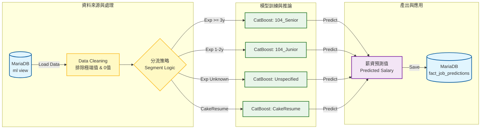

# Machine Learning Pipeline Documentation

本目錄包含薪資預測模型的完整流程，從資料載入、特徵工程、模型訓練到預測產出。
最新的模型採用 **Granular Segmentation (細緻分群)** 策略，大幅提升了預測準確度。

## 核心架構 (Core Architecture)



### 1. 分群策略 (Granular Segmentation)

為了應對不同來源與職涯階段的薪資結構差異，我們將模型拆分為 **4 個專屬子模型**。
下表補充了 **MAE (平均絕對誤差)**，讓我們知道預測薪資與真實薪資的平均差距：

| 模型名稱            | 適用對象                    | 特徵                         | 預測表現 (R²)        | MAE (誤差範圍) |
| :------------------ | :-------------------------- | :--------------------------- | :------------------- | :------------- |
| **104_Senior**      | 104 人力銀行, 經歷 >= 3 年  | 資深職缺，薪資與技能高度相關 | **0.52** (Excellent) | ± 12,910 TWD   |
| **104_Junior**      | 104 人力銀行, 經歷 1~2 年   | 初階職缺，薪資變異小         | **0.25** (Good)      | ± 7,308 TWD    |
| **104_Unspecified** | 104 人力銀行, 經歷不拘/0 年 | 經歷要求不明確的職缺         | 0.21 (Fair)          | ± 7,993 TWD    |
| **CakeResume**      | CakeResume 來源             | 外商/新創風格，薪資結構特殊  | (樣本累積中)         | ± 25,008 TWD   |

### 2. 資料品質控制與防洩漏 (Data Quality Control & Leakage Prevention)

我們執行嚴格的**樣本篩選 (Sample Selection)** 機制來確保模型學習品質：

- **資料清洗 (Cleaning)**：我們發現資料庫中部分「面議」職缺被填補為 `0`。這在訓練中屬於**雜訊 (Noise)**，若不處理會導致模型學習到「薪資=0」。
- **修正方案**：
  - **訓練集 (Training Set)**：僅使用 `salary_min > 0` 的資料，確保模型只學習「有市場定價」的優質樣本。
  - **預測集 (Prediction Set)**：推論階段則涵蓋所有職缺 (zero-shot prediction)。

### 3. 特徵工程 (Feature Engineering)

模型採用以下特徵組合 (約 500+ 維度)：

- **職缺描述 (Description)**: 使用 `jieba` 分詞 + TF-IDF 取前 100 關鍵字。
- **技能 (Skills)**: 常見技術關鍵字 (Python, Java, AWS...) One-Hot Encoding。
- **地點 (Location)**: 縣市層級特徵。
- **公司福利 (Benefits)**: _New!_ 加入福利關鍵字作為特徵。
- **交叉特徵 (Cross Features)**: 職稱 x 地點、技能 x 地點的交互作用。

### 4. 模型選擇與演算法 (Model Selection & Algorithms)

本專案在開發與生產階段採用了不同的策略。為了讓大家更容易理解，我們可以將 AI 視為一位**虛擬的面試官**。

#### A. 正式生產模型 (Production Model): **CatBoost**

在正式上線的 `generate_predictions.py` 中，我們選用 **CatBoostRegressor** 作為主力模型。

- **為什麼選它？（白話解釋）**
  1.  **天生看得懂「類別」**：一般的 AI 模型只能處理數字，遇到「台積電」、「Google」這種公司名稱，通常需要轉換成一長串的 **0 與 1 數字串** (這在技術上叫 One-Hot Encoding，就像是為了區分 3000 家公司，你必須列一張有 3000 個格子的超長表格，然後只在其中一格打勾)。這樣做既浪費空間又沒效率。而 CatBoost 就像一位**資深獵頭**，它原生就能直接理解「台積電」這三個字背後的價值與標籤意義，不需要經過繁瑣的轉換，因此更準確且節省資源。
  2.  **不愛「死背答案」**：在資料量較少（如 CakeResume 只有數百筆）的情況下，很多 AI 容易「死背」看過的資料（過擬合）。CatBoost 的演算法設計讓它更傾向於尋找**通則**，而非死記硬背，這讓預測更穩健。
  3.  **反應速度快**：它的推論效率極高，能瞬間對數千筆職缺完成估價。

#### B. 診斷實驗模型 (Diagnostic Model): **Ensemble Voting**

在早期的研究階段 (`predict_salary_model.py`)，我們使用了 **Ensemble Learning (集成學習)**。

- **這是什麼概念？**
  - 這就像是**「三個臭皮匠，勝過一個諸葛亮」**。我們不只問一位面試官，而是組建了一個**專家委員會**來投票：
  1.  **Random Forest (隨機森林)**：像是請來 100 位普通面試官，每人投一票再取平均。這能有效消除個人的偏見與極端值。
  2.  **XGBoost**：像是一位追求完美的專家，會不斷檢討前一次預測的錯誤並修正，準確度通常最高。
  3.  **Lasso Regression**：像是一位極簡主義者，專門負責挑出真正重要的條件，把不相關的雜訊（如無關緊要的技能）刪除。

_最終決策：雖然「專家委員會」準度略高一點點，但維護成本太高（要養三批人）。考量到 **CatBoost（資深獵頭）** 單兵作戰能力以足夠強大且效率更高，因此生產環境決定由它獨挑大樑。_\_

## 檔案說明

### 系統核心

- **`generate_predictions.py`** : **[Production]** 正式預測腳本。執行完整的 ETL -> Training -> Prediction 流程，並將結果寫入資料庫 `fact_job_predictions`。
- **`ml_data_loader.py`** : 資料載入器。負責從資料庫讀取並正規化資料 (時薪轉月薪、排除極端值)。

### 實驗與診斷

- **`predict_salary_model.py`** : **[Development]** 開發與診斷腳本。用於測試新的分群策略、繪製 R² 診斷圖 (`model_diagnostics_segmented.png`)。
- **`evaluate_model_performance.py`** : 舊版評估腳本 (已整合至 predict_salary_model)。

## 執行方式

若要更新整個薪資預測資料庫：

```bash
# 1. 確保位於 step3 目錄
cd e:\Antigravity_HOME_PC\WLS\step3_machine_learning_pipeline

# 2. 執行預測 (需確保 DB 連線正常)
python generate_predictions.py
```

執行後，可至前端 Dashboard 查看最新預測結果 (記得重啟 Web App)。
