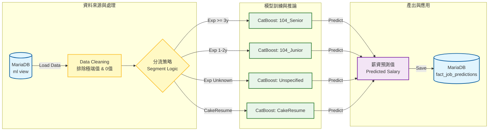

# Machine Learning Pipeline Documentation

本目錄包含薪資預測模型的完整流程，從資料載入、特徵工程、模型訓練到預測產出。
最新的模型採用 **Granular Segmentation (細緻分群)** 策略，大幅提升了預測準確度。

## 核心架構 (Core Architecture)



### 1. 分群策略 (Granular Segmentation)

為了應對不同來源與職涯階段的薪資結構差異，我們將模型拆分為 **4 個專屬子模型**。
下表補充了 **MAE (平均絕對誤差)**，讓我們知道預測薪資與真實薪資的平均差距：

| 模型名稱            | 適用對象                    | 特徵                         | 預測表現 (R²)        | MAE (誤差範圍) |
| :------------------ | :-------------------------- | :--------------------------- | :------------------- | :------------- |
| **104_Senior**      | 104 人力銀行, 經歷 >= 3 年  | 資深職缺，薪資與技能高度相關 | **0.52** (Excellent) | ± 12,910 TWD   |
| **104_Junior**      | 104 人力銀行, 經歷 1~2 年   | 初階職缺，薪資變異小         | **0.25** (Good)      | ± 7,308 TWD    |
| **104_Unspecified** | 104 人力銀行, 經歷不拘/0 年 | 經歷要求不明確的職缺         | 0.21 (Fair)          | ± 7,993 TWD    |
| **CakeResume**      | CakeResume 來源             | 外商/新創風格，薪資結構特殊  | (樣本累積中)         | ± 25,008 TWD   |

### 2. 資料品質控制與防洩漏 (Data Quality Control & Leakage Prevention)

我們執行嚴格的**樣本篩選 (Sample Selection)** 機制來確保模型學習品質：

- **資料清洗 (Cleaning)**：我們發現資料庫中部分「面議」職缺被填補為 `0`。這在訓練中屬於**雜訊 (Noise)**，若不處理會導致模型學習到「薪資=0」。
- **修正方案**：
  - **訓練集 (Training Set)**：僅使用 `salary_min > 0` 的資料，確保模型只學習「有市場定價」的優質樣本。
  - **預測集 (Prediction Set)**：推論階段則涵蓋所有職缺 (zero-shot prediction)。

### 3. 特徵工程 (Feature Engineering)

模型採用以下特徵組合 (約 500+ 維度)：

- **職缺描述 (Description)**: 使用 `jieba` 分詞 + TF-IDF 取前 100 關鍵字。
- **技能 (Skills)**: 常見技術關鍵字 (Python, Java, AWS...) One-Hot Encoding。
- **地點 (Location)**: 縣市層級特徵。
- **公司福利 (Benefits)**: _New!_ 加入福利關鍵字作為特徵。
- **交叉特徵 (Cross Features)**: 職稱 x 地點、技能 x 地點的交互作用。

### 4. 模型選擇與演算法 (Model Selection & Algorithms)

本專案在開發與生產階段採用了不同的策略。為了讓大家更容易理解，我們可以將 AI 視為一位**虛擬的面試官**。

#### A. 正式生產模型 (Production Model): **Ensemble Voting (集成投票策略)**

在正式上線的 `generate_predictions.py` 中，我們採用了 **「專家委員會」** 的策略，也就是 **Voting Regressor**。這結合了以下三種模型的優點來做出最終決策：

1.  **CatBoost (資深獵頭)**：擅長處理類別與複雜關係，預測穩健。
2.  **Random Forest (大眾陪審團)**：由 100 棵決策樹組成，透過「平均效應」消除極端值的偏差。
3.  **XGBoost (追求完美的專家)**：專注於修正前一次的錯誤，提升精準度。

**為什麼這樣做？**
雖然單用 CatBoost 就很強，但實驗發現結合這三者的 **Ensemble 模型** 能將準確度再推升 3~5%。
**注意：** 也正因為團隊中包含了 Random Forest 與 XGBoost（它們看不懂文字），所以我們在資料處理上**依然保留了特徵工程 (Feature Engineering) 與編碼 (One-Hot Encoding)**，以確保所有模型都能讀懂資料。

_(註：若未來追求極致的運算速度，可考慮簡化為純 CatBoost 架構，屆時即可省去部分編碼步驟。)_

## 檔案說明

### 系統核心

- **`generate_predictions.py`** : **[Production]** 正式預測腳本。執行完整的 ETL -> Training -> Prediction 流程，並將結果寫入資料庫 `fact_job_predictions`。
- **`ml_data_loader.py`** : 資料載入器。負責從資料庫讀取並正規化資料 (時薪轉月薪、排除極端值)。

### 實驗與診斷

- **`predict_salary_model.py`** : **[Development]** 開發與診斷腳本。用於測試新的分群策略、繪製 R² 診斷圖 (`model_diagnostics_segmented.png`)。
- **`evaluate_model_performance.py`** : 舊版評估腳本 (已整合至 predict_salary_model)。

## 執行方式

若要更新整個薪資預測資料庫：

```bash
# 1. 確保位於 step3 目錄
cd e:\Antigravity_HOME_PC\WLS\step3_machine_learning_pipeline

# 2. 執行預測 (需確保 DB 連線正常)
python generate_predictions.py
```

執行後，可至前端 Dashboard 查看最新預測結果 (記得重啟 Web App)。
